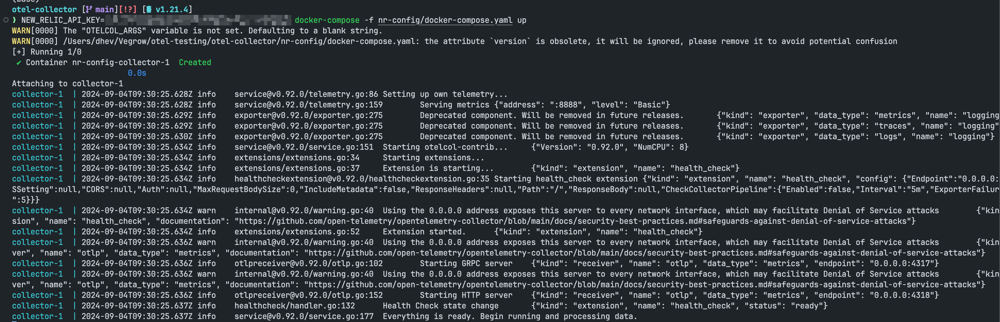
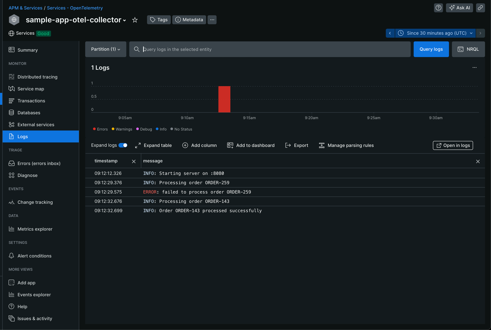
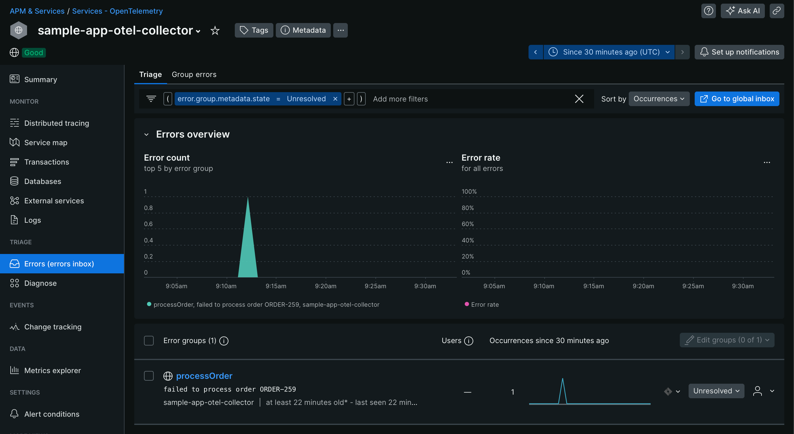
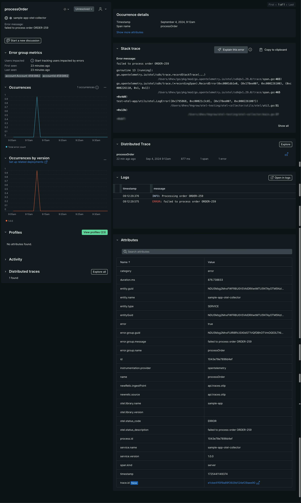
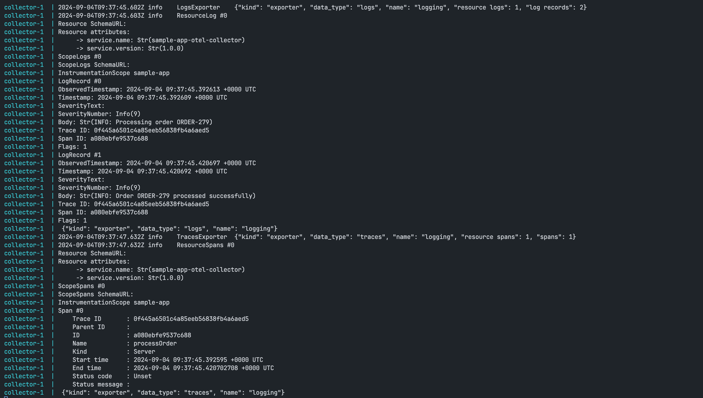

# OpenTelemetry Collector with OTLP Export to New Relic

Reference Guide: [newrelic-opentelemetry-examples](https://github.com/newrelic/newrelic-opentelemetry-examples/blob/main/other-examples/collector/nr-config/README.md)

### How does collector work?

Reference Guide: [OpenTelemetry Data Collector](https://docs.newrelic.com/docs/opentelemetry/get-started/collector-processing/opentelemetry-collector-processing-intro/)

### How to set up?

1. NEW_RELIC_API_KEY=your-key docker-compose -f nr-config/docker-compose.yaml up
2. make sure to export OTEL_EXPORTER_OTLP_ENDPOINT=localhost:4317 and set ENV accordingly
3. start the go application
4. make requests to test logging and errors: curl "http://localhost:8080/order"

## Screenshots

### Collector Component

### NewRelic Logs

### NewRelic Errors Inbox

### Captured Telemetry on Collector

